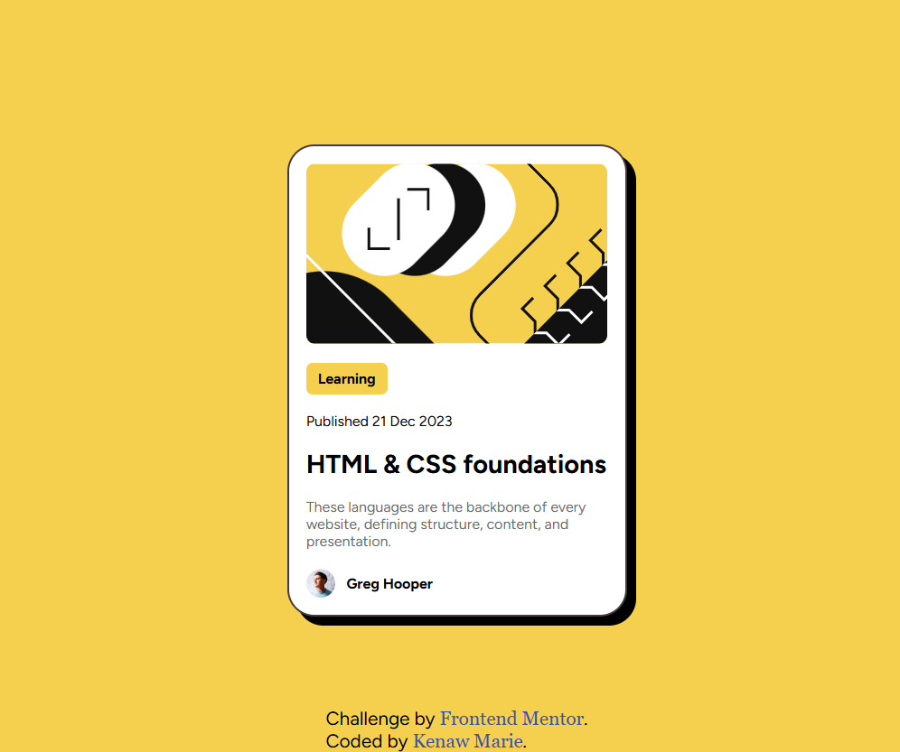

# Frontend Mentor - Blog preview card 

This is a solution to the [Blog preview card challenge on Frontend Mentor](https://www.frontendmentor.io/challenges/blog-preview-card-ckPaj01IcS). 

## Table of contents
- [Screenshot](#screenshot)
- [Links](#links) 
- [Built with](#built-with)
- [What I learned](#what-i-learned) 
- [Author](#author)
- [Acknowledgments](#acknowledgments) 

### Screenshot

### Links

- Live Site URL: [Front Blog Preview Card](https://kenawmarie.github.io/front-Blog-preview-card/) 

### Built with

- Semantic HTML5 markup
- CSS custom properties
- Flexbox 

### What I learned

the main think i learnt from this project is how to use the font-face.

## Author

- Website - [Kenaw Marie](https://github.com/KenawMarie)
- Frontend Mentor - [@kenawMarie](https://www.frontendmentor.io/profile/yourusername) 

## Acknowledgments

My special thanks to the free code camp for helping me to start web development and the Odin project. and also for frontend mentor for this challenge.
